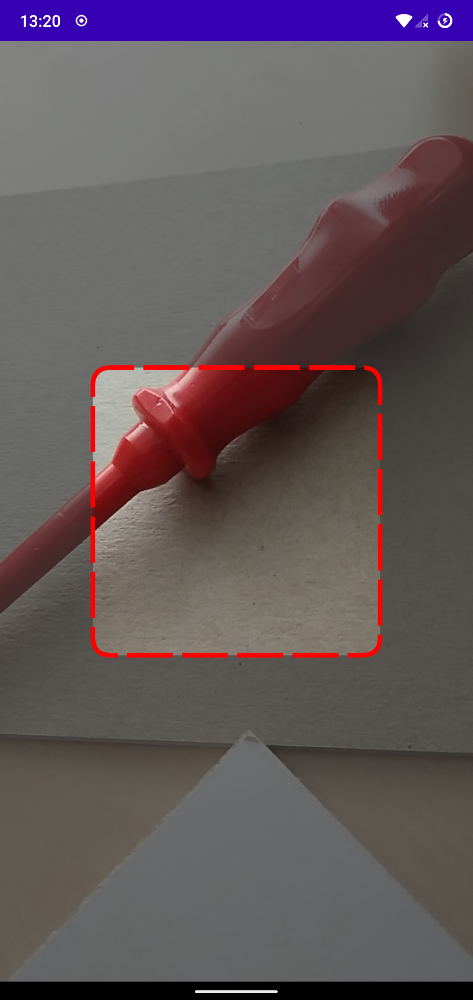
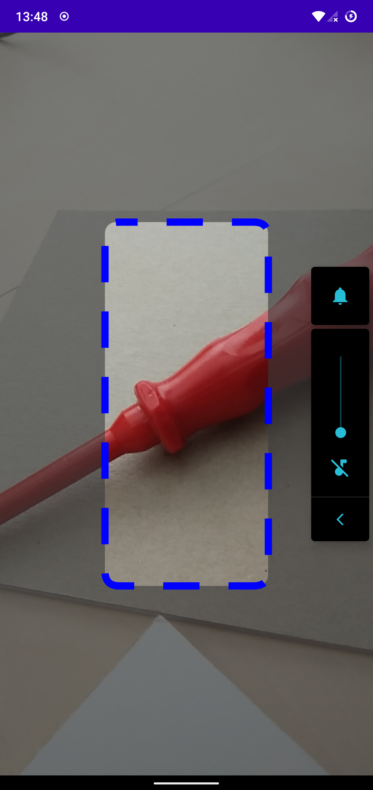

## GraphicOverlay Showcase
This is just one possible way to create a graphic overlay over a camera preview view in Jetpack Compose.

#### Example
See screenshot below:  


#### Usage:
The GraphicOverlay accepts an optional ScannerOverlayGraphic object as parameter.
If you don't pass anything it will be filled with sensible defaults as a red focusgraphic with a dashed-border.  
Nonetheless you can copy the ScannerOverlayGraphic and style it to your needs and then pass it as parameter to your CameraView:
```kotlin
val overlayGraphic = ScannerOverlayGraphic(
    focusBorderColor = Color.Blue,
    focusBorderWidth = 180.dp,
    focusBorderHeight = 400.dp,
    focusBorderStrokeWidth = 8.dp,
    focusBorderStrokeLength = 40.dp,
    focusBorderStrokeGap = 32.dp,
    focusBorderCornerRadius = 16.dp,
    focusBorderStrokeCap = StrokeCap.Butt,
    backgroundDimmed = true
)
CameraView(modifier.fillMaxSize(), graphicOverlay = overlayGraphic)
```
to get a view like this:  
